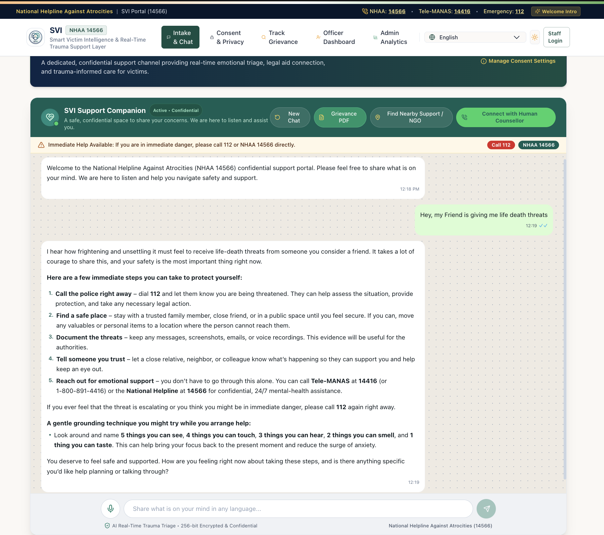
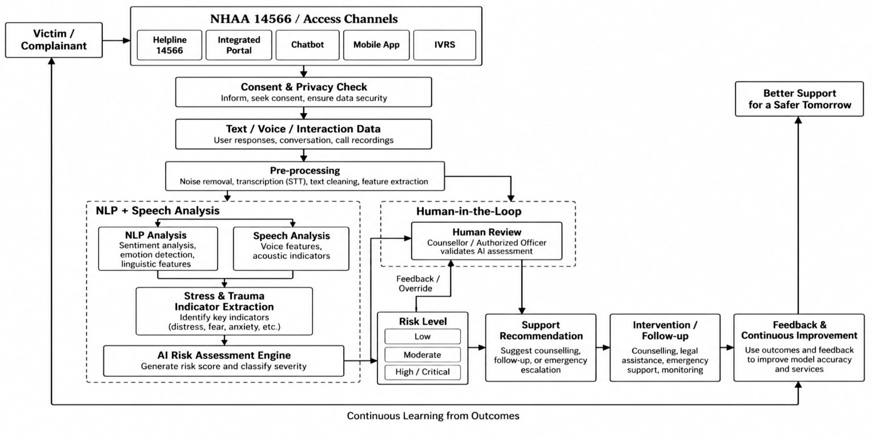

<h1 align="center"> Smart Victim Intelligence (SVI) </h1>

<p align="center">
  
</p>

<h3 align="center">From Listening to Meaningful Support</h3>

<p align="center">
  An AI-powered, privacy-first support system designed to identify distress signals during victim/complainant interactions and connect high-risk cases with timely human intervention.
</p>

<p align="center">
  <a href="https://svi-frontend.onrender.com">
    
  </a>
  <a href="https://github.com/atul-vish/Smart-Victim-Intelligence-SVI-">
    
  </a>
</p>

<p align="center">
  
  
  
  
</p>

---

## Overview

**Smart Victim Intelligence (SVI)** is an AI-assisted real-time stress and trauma assessment concept developed for **Smart India Hackathon 2026 – Problem Statement SIH26093**.

The system is designed to work alongside **NHAA (14566)** and its digital access channels, including the integrated portal, chatbot, mobile application and IVRS. It focuses on analyzing voluntary user interactions such as text, voice and conversational responses to identify indicators of emotional distress and trauma.

The core idea is simple:

> **Listen to the interaction → identify distress signals → assess risk → involve a human → provide timely support.**

SVI is designed around four principles:

- **Victim-Centric**
- **Privacy-First**
- **Scalable**
- **Human-in-the-Loop**

---

## Problem Statement

**Problem Statement ID:** `SIH26093`

**Title:**  
**AI-Based Real-Time Stress and Trauma Assessment Module for Victims/Complainants Accessing NHAA (14566) and Integrated Portal**

**Theme:** MedTech / BioTech / HealthTech  
**PS Category:** Software  
**Team:** Veom Vegas

Traditional support systems may receive large amounts of unstructured information through calls, portals and digital conversations. SVI proposes an AI-assisted layer that can transform voluntary interaction data into structured assessment insights while keeping human review in the decision loop.

### What SVI aims to address

- Detect emotional distress during the interaction itself.
- Identify potentially high-risk cases earlier.
- Prioritize cases requiring human attention.
- Convert unstructured conversations into actionable assessment insights.
- Enable a consistent assessment approach across helpline and digital channels.

---

## Solution

SVI combines conversational AI, NLP, speech analysis and human validation into a single support workflow.

The proposed assessment pipeline accepts interaction data after a **consent and privacy check**, performs preprocessing, extracts textual and acoustic indicators, generates a non-diagnostic risk assessment and routes the case toward appropriate human intervention.

### Core capabilities

| Capability | Description |
|---|---|
| 1. Real-Time AI Assessment | Analyze interaction signals during the conversation |
| 2. NLP Analysis | Sentiment, emotion and linguistic signal extraction |
| 3. Speech Analysis | Acoustic indicators such as tone and pitch |
| 4. Risk Classification | Low / Moderate / High / Critical risk levels |
| 5. Human-in-the-Loop | Counselor or authorized officer validates AI assessment |
| 6. Emergency Escalation | Emergency support pathway for critical situations |
| 7. Professional Support | Therapist/counselor discovery and follow-up |
| 8. Multilingual Access | Designed for Hindi, English and Indian-language/dialect support |
| 9. Privacy-First | Consent-driven data collection and security controls |
| 10. Continuous Improvement | Outcomes and feedback can improve future assessments |

---

# System Architecture

The architecture below is based on the workflow presented in the SIH solution deck.

```text
Victim / Complainant
        │
        ▼
NHAA 14566 / Access Channels
 ┌────────────┬──────────────┬──────────┬────────────┬───────┐
 │ Helpline   │ Integrated   │ Chatbot  │ Mobile App │ IVRS  │
 │ 14566      │ Portal       │          │            │       │
 └────────────┴──────────────┴──────────┴────────────┴───────┘
        │
        ▼
Consent & Privacy Check
        │
        ▼
Text / Voice / Interaction Data
        │
        ▼
Pre-processing
        │
        ├───────────────► NLP Analysis
        │                    │
        │                    └── Sentiment / Emotion / Linguistic Signals
        │
        └───────────────► Speech Analysis
                             │
                             └── Tone / Pitch / Acoustic Indicators
                                      │
                                      ▼
                           Stress & Trauma Indicators
                                      │
                                      ▼
                           AI Risk Assessment Engine
                                      │
                                      ▼
                              Risk Classification
                         ┌────────┬──────────┬──────────────┐
                         │  Low   │ Moderate │ High/Critical│
                         └────────┴──────────┴──────────────┘
                                      │
                                      ▼
                              Human Validation
                                      │
                                      ▼
                            Support Recommendation
                                      │
                                      ▼
                            Intervention / Follow-up
                                      │
                                      ▼
                         Feedback & Improvement
                                      │
                                      └──────► Continuous Learning
```

### Official workflow diagram

The complete workflow diagram from the project presentation is included directly in this repository:



The workflow covers:

**Victim/Complainant → Access Channels → Consent & Privacy → Interaction Data → Pre-processing → NLP + Speech Analysis → Stress & Trauma Indicator Extraction → AI Risk Assessment → Human Review → Risk Level → Support Recommendation → Intervention/Follow-up → Continuous Improvement.**

---

# AI Assessment Layer

The proposed multimodal assessment layer combines textual and audio signals.

### Text / NLP signals

The SIH design uses NLP signals for:

- Sentiment analysis
- Emotion detection
- Linguistic feature extraction
- Identification of distress-related statements
- Multilingual and code-mixed language support

The presentation specifies a **60% text/NLP contribution** to the multimodal risk fusion.

### Audio / Speech signals

The speech-processing layer is designed to analyze:

- Voice features
- Acoustic indicators
- Tone
- Pitch
- Prosodic patterns

The presentation specifies a **40% audio/acoustic contribution** to risk scoring.

### Risk score

The proposed assessment uses a:

> **Non-diagnostic trauma score from 0–100**

The score is intended as an assessment-support signal rather than a medical diagnosis.

---

# Current AI Agent Implementation

The current repository contains a working conversational AI implementation built around an agentic backend.

### Agent tools

SVI currently exposes three major agent capabilities:

1. **Mental-health conversational support**
   - Uses the MedGemma model through Ollama.
   - Generates supportive conversational responses.

2. **Emergency escalation**
   - Uses Twilio for an emergency calling workflow.
   - The application also directs users toward India's emergency number `112`.

3. **Nearby therapist support**
   - Provides professional-support recommendations and an appointment pathway through Docvita.

### Agent orchestration

The agent layer uses:

- LangChain
- LangGraph ReAct agent
- Groq-hosted LLM for orchestration
- Tool-based routing for specialist support, emergency escalation and therapist discovery

---

# Technology Stack

The repository's current implementation uses the following technologies:

| Layer | Technology |
|---|---|
| Frontend | Streamlit |
| Backend | FastAPI |
| Agent Orchestration | LangGraph |
| LLM Interface | LangChain + Groq |
| Local AI Model | Ollama + MedGemma |
| API | REST |
| Validation | Pydantic |
| Emergency Calling | Twilio |
| HTTP Client | Requests |
| Server | Uvicorn |
| Language | Python |

### Proposed / SIH architecture stack

The SIH technical approach additionally describes an architecture using:

- React / Next.js
- Python
- PyTorch
- Hugging Face
- NLP / LLM / classification models
- PostgreSQL
- FastAPI
- Whisper STT
- Voice feature analysis
- REST APIs
- RBAC
- Encryption
- Consent management
- Cloud infrastructure

This distinction keeps the README aligned with both the **current repository implementation** and the **broader architecture proposed in the SIH presentation**.

---

# Privacy, Safety & Human-in-the-Loop

SVI is designed as a **support and decision-assistance system**, not as an autonomous replacement for trained professionals.

### Privacy-first workflow

```text
User Interaction
      ↓
Consent
      ↓
Secure Data Processing
      ↓
AI Assessment
      ↓
Human Validation
      ↓
Support / Intervention
```

### Human validation

AI-generated risk signals are intended to support:

- Counselors
- Authorized officers
- Human case reviewers
- Support personnel

High-risk cases should receive human attention rather than relying solely on automated classification.

### Safety principle

SVI should never be treated as a substitute for emergency services or qualified mental-health professionals.

For immediate danger in India, users should contact **112** directly. The application also references **Tele-MANAS: 14416 / 1-800-891-4416** for 24/7 mental-health support.

---

# Access Channels

The proposed architecture is designed to support multiple entry points:

```text
                    SVI
                     │
       ┌─────────────┼─────────────┐
       │             │             │
   Helpline       Web Portal     Chatbot
       │             │             │
       └─────────────┼─────────────┘
                     │
               Mobile App
                     │
                    IVRS
```

The SIH presentation identifies **5 access channels**:

- Helpline 14566
- Web / Integrated Portal
- Chatbot
- Mobile App
- IVRS

---

# Impact & Benefits

### Early Distress Detection

Real-time identification of distress indicators during victim interactions.

### Improved Victim Support

Conversational data can be transformed into structured support insights.

### Prioritized Intervention

Risk levels can help guide urgent case allocation and human review.

### Data-Driven Decisions

Privacy-preserving analytics can help identify broader patterns.

### Multilingual Access

Designed to support Hindi, English and Indian-language/dialect interactions.

### Scalable Integration

A common assessment engine can support multiple NHAA access channels.

---

# Impact Chain

```text
Interaction
     ↓
AI Assessment
     ↓
Risk Classification
     ↓
Human Intervention
     ↓
Timely Support
     ↓
Better Outcomes
```

**Victim-Centric • Privacy-First • Scalable • Human-in-the-Loop**

---

# Project Structure

```text
Smart-Victim-Intelligence-SVI-/
│
├── backend/
│   ├── ai_agent.py
│   ├── tools.py
│   └── ...
│
├── frontend.py
├── main.py
├── config.py
├── requirements.txt
├── pyproject.toml
├── quiet_horizon_bg.png
├── assets/
│   └── svi-workflow.png
│
└── README.md
```

> The exact repository structure may evolve as the project expands toward the complete multimodal SIH architecture.

---

# Getting Started

## 1. Clone the repository

```bash
git clone https://github.com/atul-vish/Smart-Victim-Intelligence-SVI-.git
cd Smart-Victim-Intelligence-SVI-
```

## 2. Create a virtual environment

### Windows

```powershell
python -m venv .venv
.venv\Scripts\activate
```

### macOS / Linux

```bash
python3 -m venv .venv
source .venv/bin/activate
```

## 3. Install dependencies

```bash
pip install -r requirements.txt
```

## 4. Configure environment variables

Create a `.env` file and configure the credentials required by the current implementation, including the AI provider and Twilio integration.

Do **not** commit secrets, API keys, authentication tokens or private credentials to GitHub.

Example:

```env
GROQ_API_KEY=your_groq_api_key

TWILIO_ACCOUNT_SID=your_twilio_account_sid
TWILIO_AUTH_TOKEN=your_twilio_auth_token
TWILIO_FROM_NUMBER=your_twilio_number
EMERGENCY_CONTACT=your_emergency_contact
```

Use the variable names expected by `config.py` in the repository.

---

# Local MedGemma Setup

The current conversational specialist tool uses **Ollama** with the MedGemma model.

Install Ollama, then pull the model used by the project:

```bash
ollama pull alibayram/medgemma:4b
```

Start Ollama before launching the application.

---

# Run the Backend

From the project root:

```bash
uvicorn main:app --host 0.0.0.0 --port 8000 --reload
```

The API will be available at:

```text
http://127.0.0.1:8000
```

Main endpoint:

```text
POST /ask
```

Example request:

```json
{
  "message": "I have been feeling overwhelmed lately."
}
```

---

# Run the Frontend

In a separate terminal:

```bash
streamlit run frontend.py
```

The Streamlit application will normally open at:

```text
http://localhost:8501
```

---

# API Flow

```text
Streamlit Frontend
        │
        │ POST /ask
        ▼
FastAPI Backend
        │
        ▼
LangGraph ReAct Agent
        │
        ├──────────────► MedGemma / Ollama
        │
        ├──────────────► Emergency Call Tool / Twilio
        │
        └──────────────► Therapist Support Tool
        │
        ▼
Structured Response
        │
        ▼
Streamlit Chat Interface
```

---

# Example Interaction

```text
User
  ↓
"I have been feeling extremely anxious and don't know who to talk to."

  ↓

SVI Agent
  ↓
Understands the conversational context

  ↓

Support Tool
  ↓
Provides empathetic guidance

  ↓

If professional support is appropriate
  ↓
Therapist discovery / booking pathway

  ↓

If immediate danger is detected
  ↓
Emergency escalation + 112 guidance
```

---

# Research & References

The SIH presentation references the following sources and technical literature:

### Government / Domain References

- **National Helpline Against Atrocities (NHAA)** – Ministry of Social Justice & Empowerment, Government of India  
  https://nhapoa.gov.in/

- **The Scheduled Castes and the Scheduled Tribes (Prevention of Atrocities) Act, 1989**

- **The Protection of Civil Rights Act, 1955**

- **NHAA Annual Reports & State-wise Statistics**  
  https://nhapoa.gov.in/cms/annualReports

### Technical & Model Literature

- **RoBERTa & DistilBERT Transformers** — referenced for multi-class emotion and trauma-statement extraction.
- Liu et al. (2019), arXiv:1907.11692
- Sanh et al. (2019)
- **IndicBERT & MuRIL** — referenced for multilingual Indian-language representations, including code-mixing.
- Kakwani et al. (IndicNLP 2020)
- Google AI India
- **MedGemma & ReAct Agent Multi-Step** — referenced for AI-assisted health conversations and agentic workflows.
- Google Health AI (2024)
- Yao et al. (ICLR 2023)

---

# Smart India Hackathon 2026

| Field | Details |
|---|---|
| Hackathon | Smart India Hackathon 2026 |
| Problem Statement | SIH26093 |
| Problem | AI-Based Real-Time Stress and Trauma Assessment Module |
| Domain | MedTech / BioTech / HealthTech |
| Category | Software |
| Team | Veom Vegas |
| Solution | Smart Victim Intelligence (SVI) |
| Tagline | **From Listening to Meaningful Support** |

---

# Future Roadmap

The project can be extended toward the complete multimodal architecture described in the SIH proposal.

- [ ] Multimodal text + speech risk fusion
- [ ] Whisper-based speech-to-text pipeline
- [ ] Acoustic prosody feature extraction
- [ ] Transformer-based emotion classification
- [ ] IndicBERT / MuRIL multilingual support
- [ ] Hindi + English + dialect/code-mixed processing
- [ ] Non-diagnostic 0–100 risk scoring engine
- [ ] PostgreSQL-based secure persistence
- [ ] RBAC and stronger consent management
- [ ] Human-review dashboard
- [ ] Integrated NHAA channel adapters
- [ ] Advanced outcome-based feedback loop
- [ ] Cloud-native deployment
- [ ] Model evaluation, fairness and safety testing

---

# Responsible AI Disclaimer

SVI is an **AI-assisted support and assessment system**. It is not intended to diagnose mental-health conditions, replace qualified professionals, or make autonomous decisions about a person's care.

AI-generated signals should be treated as decision-support information and, particularly for high-risk situations, reviewed by an appropriately authorized human.

For immediate danger in India, contact **112** directly. For 24/7 mental-health support, contact **Tele-MANAS at 14416 or 1-800-891-4416**.

---

# Team Veom Vegas

**Smart Victim Intelligence — SVI**

> **From Listening to Meaningful Support**

Built for **Smart India Hackathon 2026**.

---

<p align="center">
  <b> Smart Victim Intelligence</b><br>
  <sub>Victim-Centric • Privacy-First • Scalable • Human-in-the-Loop</sub>
</p>
